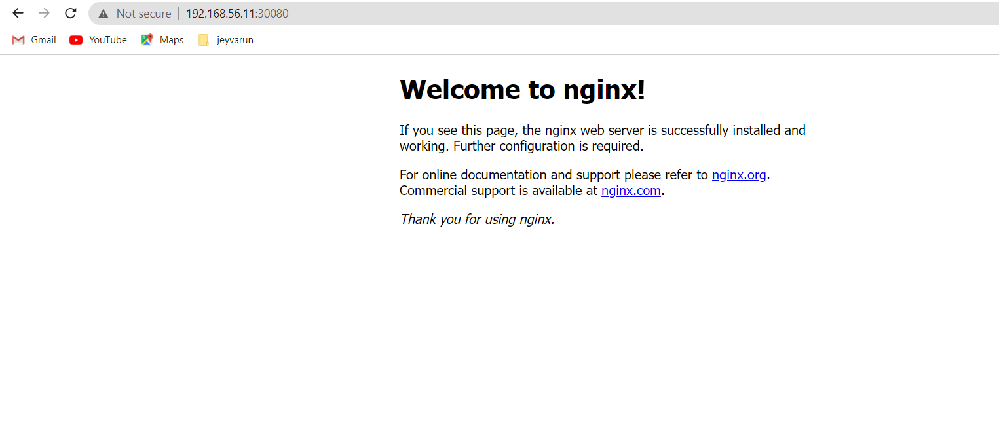

# NodePort Service

## Create pod
1. Create nginx-pod.yaml file with below content
```
# To create nginx pod
apiVersion: v1
kind: Pod
metadata:
  name: mypod
  labels:
    app: nginx    # this parameter must required to map the service
spec:
  containers:
    - name: nginx-pod
      image: nginx
```

2. Create pod using below command
```
kubectl create -f nginx-pod.yaml
```

3. Get pod details
```
saran@kube-master-1:~/yaml-files$ kubectl get po
NAME    READY   STATUS    RESTARTS   AGE
mypod   1/1     Running   0          17m
saran@kube-master-1:~/yaml-files$
```

## Create nodePort service
1. Create nginx-service.yaml file to create a service
```
# Create service for nginx pod
apiVersion: v1
kind: Service
metadata:
  name: nginx-service
spec:
  type: NodePort
  selector: 
    app: nginx
  ports:
    - protocol: TCP
      port: 80
      targetPort: 80
      nodePort: 30080
```

2. Create service using below command
```
kubectl create -f nginx-service.yaml
```

3. Get service details
```
saran@kube-master-1:~/yaml-files$ kubectl get svc
NAME            TYPE        CLUSTER-IP       EXTERNAL-IP   PORT(S)        AGE
kubernetes      ClusterIP   10.96.0.1        <none>        443/TCP        16h
nginx-service   NodePort    10.103.150.217   <none>        80:30080/TCP   6s
saran@kube-master-1:~/yaml-files$
```

5. Browse using node IP with port to access nginx pod
```
http://192.168.56.11:30080/
```
You should get output as below.
